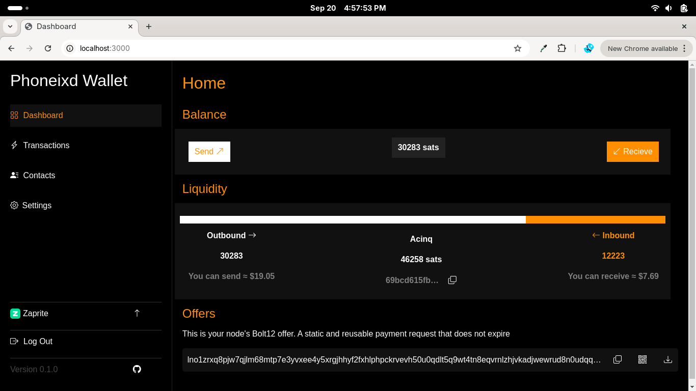
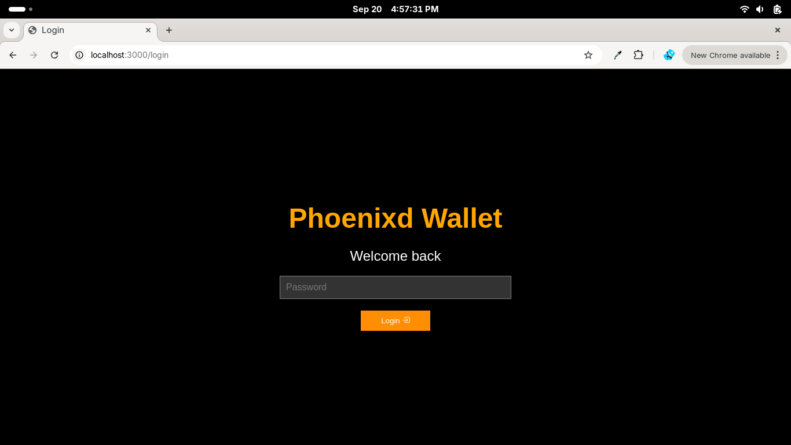
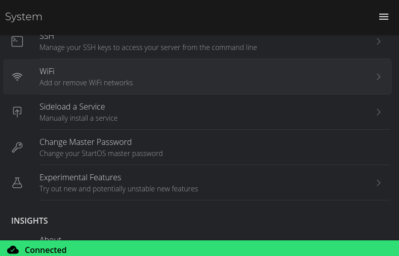
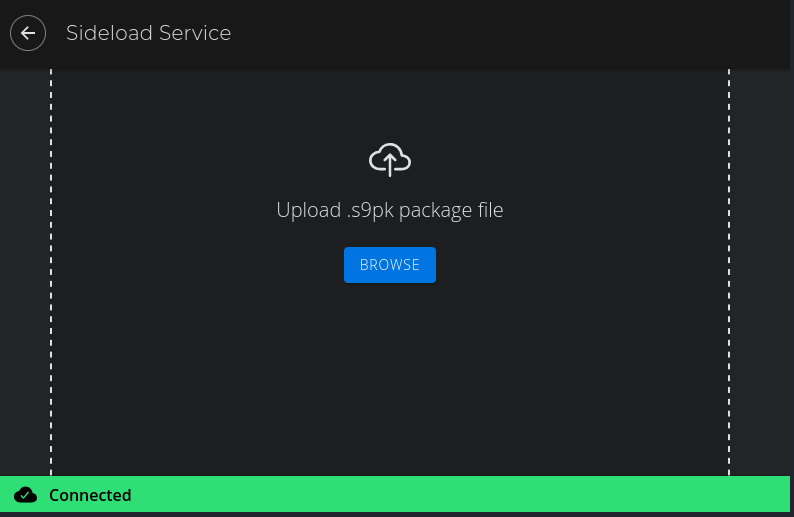
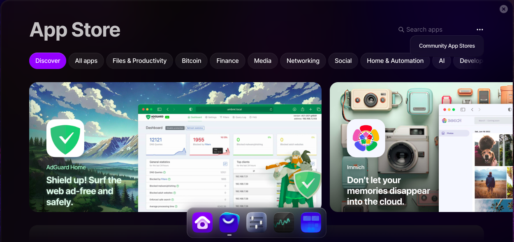
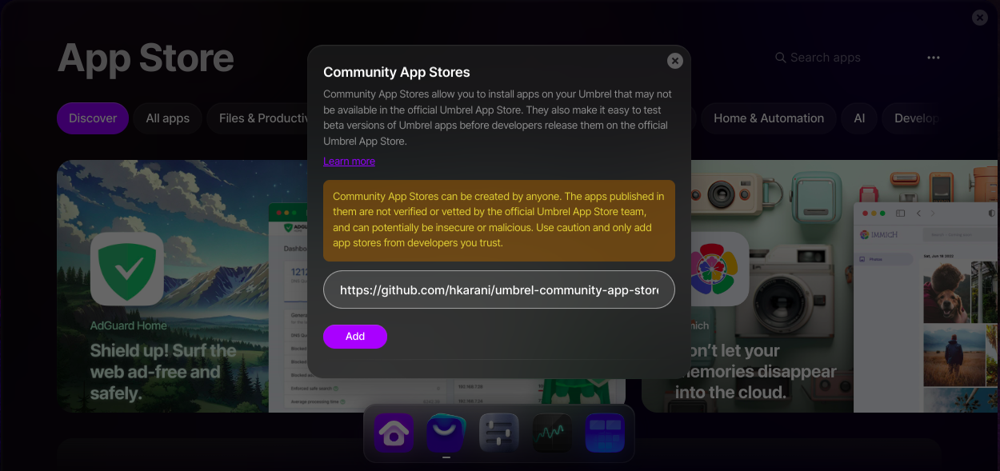
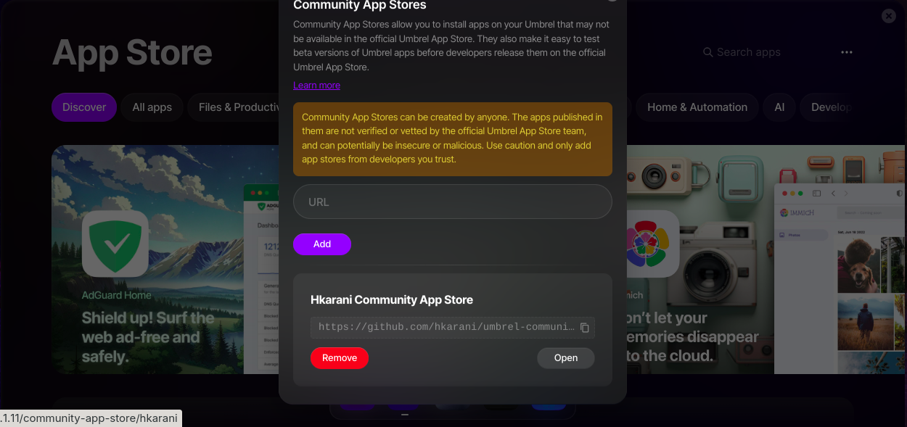
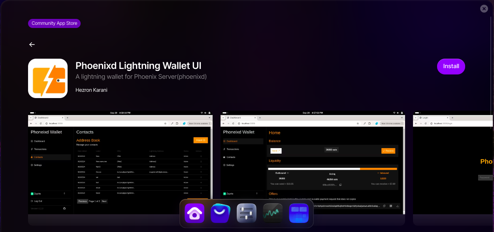

# Phoenix Server Lightning Wallet
A lighting wallet for Start9 and Umbrell on top Phoenix server.

## Table of Contents

- [Introduction](#introduction)
- [Features](#features)
- [Install on Start9Os](#installation-on-start9os)
- [Install on Umbrel](#installation-on-umbrel)

## Introduction
This project is a Lightning wallet interface built on top of [Phoenixd server](https://phoenix.acinq.co/server/) designed for [Umbrel Server](https://umbrel.com/umbrelos). 

It lets you easily manage your phoenixd transactions and leverage the power of Phoenixd for your Bitcoin Lightning wallet needs.

## Features

- [x] ~~Send and receive bitcoin with Bolt11 invoices and BOLT12 offers~~
- [x] ~~Transactions history ~~
- [x] ~~Pay wallet contacts~~
- [x] ~~Contacts address book and pay contacts~~
- [x] ~~Password login~~
- [x] ~~Import Wallet offer with QR Scan~~
- [x] ~~Scan QR to pay BOLT11 invoices and wallet offer~~

- [ ] Wallet notifications
- [ ] Create multiple wallets
- [ ] Recieve bitcoin with mainnet address
- [ ] Import wallet contacts
- [ ] Show fee credit amount
- [ ] Nostr Wallet Connect
- [ ] Choose default currency

## Installing on Start9OS
### 1. Install as a Sideload Serivice
1. Download phoenixd-lightning-wallet-ui.s9pk on your Start9os server [link] (https://github.com/hkarani/phoenixd-lightning-wallet-ui-startos/releases/download/v0.1.1/phoenixd-lightning-wallet-ui.s9pk)

2. Go **System > Sideload a Service**

3. Browse to upload phoenixd-lightning-wallet-ui.s9pk and install

## Installing on Umbrel

1. Go **Umbrell App Store**  > and click **Community App Store** athe 3-dots

2. Add the [Phoenixd Wallet Community Store link](https://github.com/hkarani/umbrel-community-app-store) 

3.Open the community store and open Phoenixd Lightning Wallet

3. Install app and open to start

